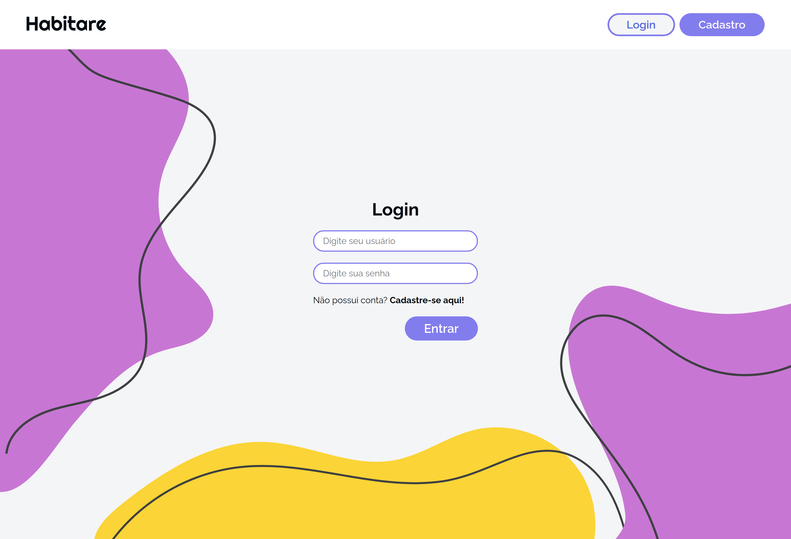
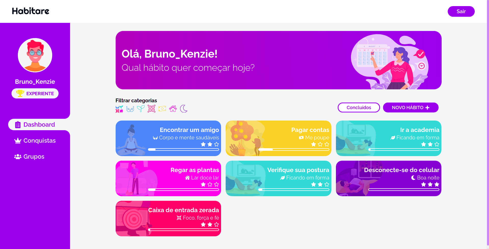
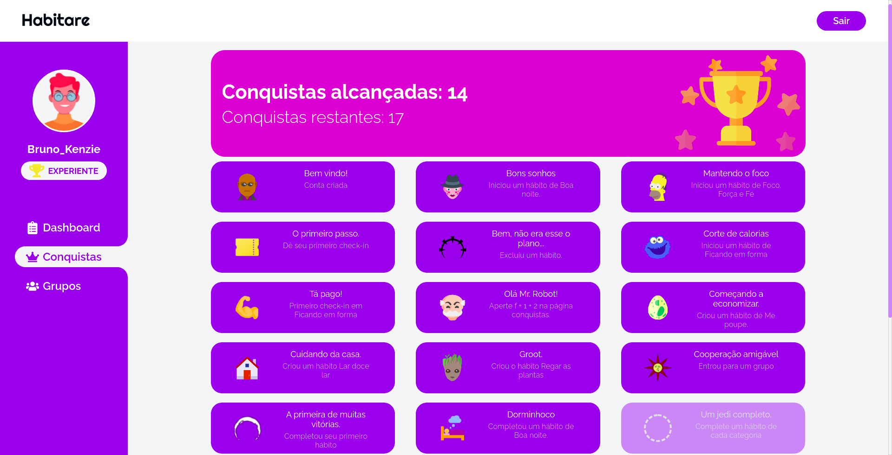
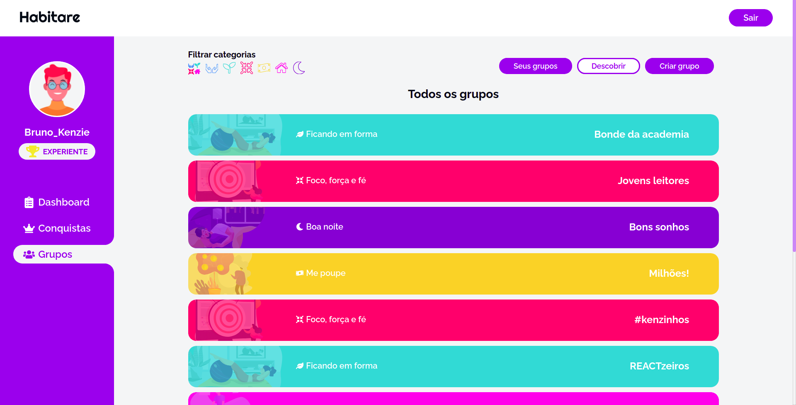
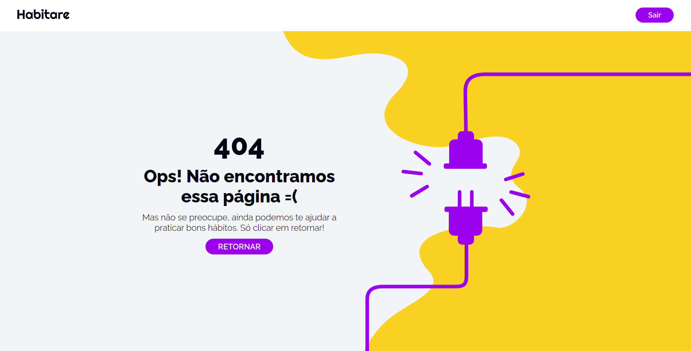

<p align="center">
  
</p>
<br>
<hr>
<br>

<h2 align="center">
  Projeto: Habitare
</h2>
<br>

<blockquote align="center">Sorria no espelho, faça isso todas as manhãs e você comecará a ver uma grande diferença em sua vida.”

(Yoko Ono)</blockquote>
<br>


<p align="center">

  <a href="LICENSE">
    
  </a>
  <a href="NPM">
    
  </a>
  <a href="GitHub followers">
    
  </a>
</p>
<hr>
<br>
<br>

# :rocket: Sobre o projeto

Acredito que pequenas mudanças nos fazem se sentir muito melhores, e o Habitare nasce com o intuito de levar motivação em uma jornada para se conquistar uma vida mais feliz, saudável e produtiva, organizando ações diárias, semanais, quinzenais ou mensais de forma que se tornem bons hábitos a serem levados por muito tempo.

Durante toda sua a jornada dentro do app, o usuário irá desbloqueia conquistas em formato de insignias e crescendo seu nível, ou seja, a partir de uma gamificação o usuário recebe estímulos para permanecer no sistema e completar seus hábitos.

Além de hábitos indivíduais e as conquistas, o Habitare também conta com grupos, que reúnem usuários com o mesmo objetivo, para se ajudarem nestas conquistas.

Este projeto foi construído em grupo, seguindo metodologia SCRUM.

**O Habitare é um projeto realizado dentro do curso de desenvolvimento full-stack da Kenzie Academy Brasil.**

**VISITE EM: https://habitare.vercel.app/**

<br>

## :computer: Tecnologias utilizadas
A seguinte stack foi utilizada na construção do projeto:

- ReactJS
- Consulta e gravação em APIs usando Axios
- Context
- React Hook Form
- Yup
- Styled-components
- React-router-dom
- JWT
- Lottie
- GreenSock

<br>

## :construction_worker: Instalação

**Primeiramente você precisa ter instalado o [Node.js](https://nodejs.org/en/download/), depois efetuar o clone deste repositório a partir do seguinte comando:**

```
git clone https://github.com/BrunoBelarminoNog/habitare.git
```

URLs SSH fornecem acesso a um repositório Git via SSH, um protocolo seguro. Se você tiver uma chave SSH registrada em
sua conta do Github, clone o projeto usando este comando:

```
git clone git@github.com:BrunoBelarminoNog/habitare.git
```

**Instale as dependências**

```
yarn || npm install
```


**Inicie o servidor**

```
yarn start || npm start
```


<br>


# :art: Layout

<br />
<p align="center">
  
</p>
<p align="center">
  
</p>
<p align="center">
  
</p>
<p align="center">
  
</p>
<p align="center">
  
</p>
<p align="center">
  
</p>
<br />


# :pushpin: Contribuindo

Sinta-se à vontade para registrar um novo problema com o respectivo título e descrição no repositório Habitare . Se você já encontrou uma solução para o problema, eu adoraria revisar sua solicitação de pull!

Verifique a página de contribuição para ver os melhores lugares para registrar problemas, iniciar discussões e começar a contribuir.


# :unlock: Licença
Lançado em 2020. Este projeto está sob a licença do MIT .

Feito com muita dedicação por Bruno Belarmino :zap:

Me siga nas redes! [LinkdIn](https://www.linkedin.com/in/bruno-belarmino-nog/)